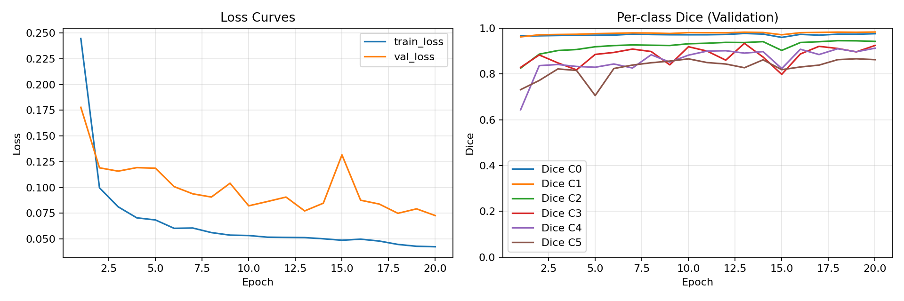
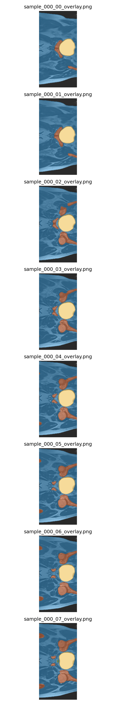

# HipMRI 2D Segmentation

This repository contains the code for a 2D U-Net model for 6-class segmentation of HipMRI scans. The model uses a deep supervision architecture, and the code provides a full pipeline for training, evaluation, and visual inference.

## 📊 Example Results

Here are the training curves and example predictions from a 20-epoch run with the default settings.




_(Note: To make these images visible in your repo, you'll need to run the code once, then commit and push the `outputs/curves.png` and `outputs/preview_overlays.png` files.)_

---

## 🚀 How to Run

Follow these steps to set up the environment, download the data, and run the code.

### 1. Get the Code

Clone the repository and navigate to the project directory:

```bash
git clone [https://github.com/rike568/PatternAnalysis-2025.git](https://github.com/rike568/PatternAnalysis-2025.git)
cd PatternAnalysis-2025
git checkout topic-recognition
cd recognition/hipmri2d_unet_45807321
```

### 2\. Set Up the Environment

You will need Conda to replicate the environment.

1.  **Install Conda:** If you don't have it, please [install Miniconda](https://docs.conda.io/en/latest/miniconda.html) for your system.

2.  **Create the Environment:** Use the provided `environment.yml` file to create the conda environment. This will install all required packages.

    ```bash
    conda env create -f environment.yml
    ```

3.  **Activate the Environment:** Before running any scripts, you must activate the new environment:

    ```bash
    conda activate comp3710
    ```

### 3\. Download the Dataset

The code requires the `HipMRI_Study_open` dataset.

**Rangpur Location:**

If you are on the `rangpur` server, you can copy the data directly from the group directory:

```bash
# This copies the dataset into your current folder
cp -r /home/groups/comp3710/HipMRI_Study_open/keras_slices_data HipMRI_Study_open
```

Your final folder structure should look like this:

```
hipmri2d_unet_45807321/
├── HipMRI_Study_open/
│   ├── keras_slices_train/
│   ├── keras_slices_seg_train/
│   ├── keras_slices_validate/
│   ├── keras_slices_seg_validate/
│   ├── keras_slices_test/
│   └── keras_slices_seg_test/
├── train.py
├── predict.py
├── dataset.py
├── modules.py
├── utils.py
└── environment.yml
```

### 4\. Train the Model

With the `comp3710` environment active, you can run the training script. Checkpoints and results will be saved to the `outputs/` folder.

**To train with default settings:**
This will use the defaults set in the script (e.g., seed=42, lr=0.0005).

```bash
python train.py
```

**To train with custom hyperparameters:**
You can override the default settings by providing command-line arguments.

- `--seed`: Set the random seed (e.g., `--seed 123`).
- `--lr`: Set the learning rate (e.g., `--lr 0.001`).
- `--weight_decay`: Set the Adam weight decay (e.g., `--weight_decay 1e-5`).
- `--grad_clip_norm`: Set the gradient clipping norm (e.g., `--grad_clip_norm 1.0`).

**Example of a custom run:**
This command trains with a learning rate of 0.001 and a seed of 123.

```bash
python train.py --lr 0.001 --seed 123
```

### 5\. Run Predictions

After training, you can run inference on the test set. This will load the `best.pt` checkpoint from the `outputs/` folder, calculate final Dice scores, and save visual predictions to `outputs/predictions/`.

**To run with the default seed (42):**

```bash
python predict.py
```

**To run with a custom seed:**
You can specify a different seed for reproducibility.

```bash
python predict.py --seed 123
```
