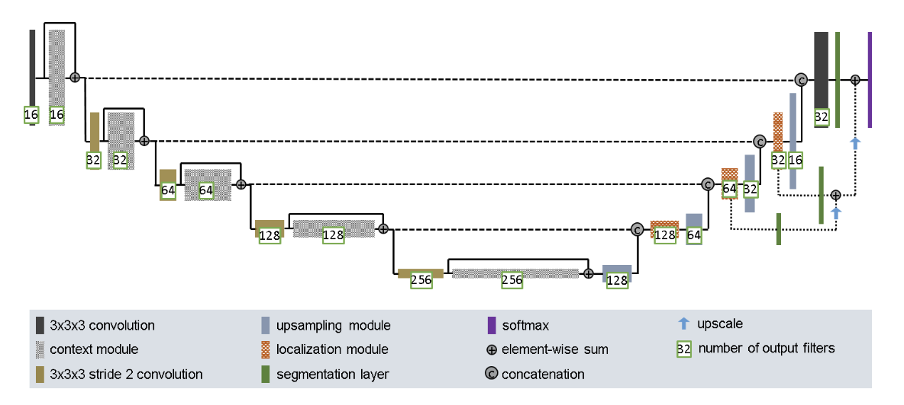
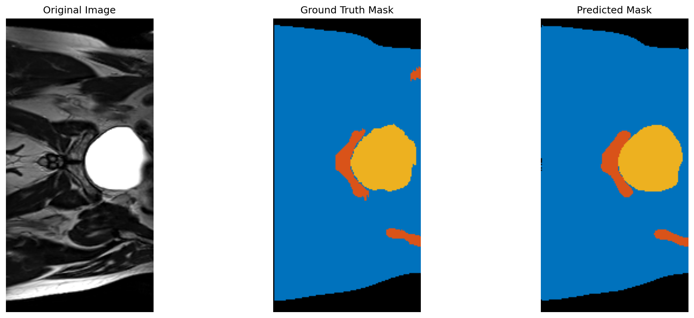
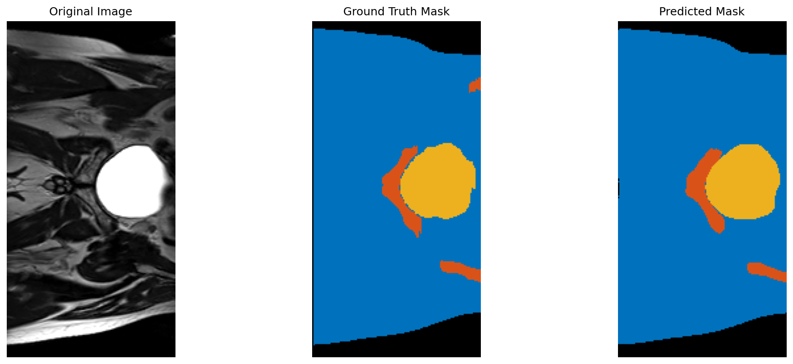
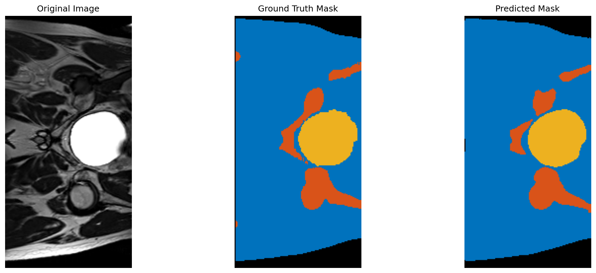

# HipMRI 2D Segmentation

## About

This repository contains the code for a 2D U-Net model for 6-class segmentation of HipMRI scans. The model uses a deep supervision architecture, and the code provides a full pipeline for training, evaluation, and visual inference.

The problem that I have been tasked with is to create a model that can perform segmentation on the provided hip MRI dataset. More specifically, we are trying to outline the prostate gland so that professionals can more easily look for signs of prostate cancer. To do this, I have created an improved 2D U-Net model that was designed for the purpose of image segmentation, which is exactly what I'm required to do.

How does this algorithm work? A normal 2D U-Net model works with the standard encoder, decoder, and skip connections. The improved 2D U-Net is similar; however, it just refines it further. For example, instead of utilizing Batch Normalization and ReLU, it instead uses Instance Normalization that will allow for more stable training. The below image shows an example of all the components that make up the 2D Improved U-Net model.

[1](#ref-1)

## 📊 Example Results

Here are the training curves and example predictions from a 20-epoch run with the default settings.

### Training Curves


The plot on the left showcase the train_loss and validation_loss over the 20 epochs that were ran. The plot on the right showcases the dice coeffeicent over the 20 epochs.

## Outputs

The below are simple images that were created after the prediciton was ran on the model that was created.

It can be seen that the prediction isn't too far off from the ground truth, but there is still definitely room for improvement as it can bee seen that the model is still doing some underestimations.

### Output 1



### Output 2



### Output 3



### Dice coefficents

The below are the end dice coefficents that I had after the mdoel was trained.

For the first 4 classes it can be seen that the dice coefficents are excellent, proably due to the fact that these features appear more overtly. For the last features my model still has decent dice coefficeints however, not as good as the first 4 probably due to the fact these features are a lot smaller, so are harder to pinpoint.

Per-class Dice: C0:0.982 C1:0.984 C2:0.942 C3:0.970 C4:0.876 C5:0.839
Mean Dice: 0.932

## 🚀 How to Run

Follow these steps to set up the environment, download the data, and run the code.

### 1. Get the Code

Clone the repository and navigate to the project directory:

```bash
git clone [https://github.com/rike568/PatternAnalysis-2025.git](https://github.com/rike568/PatternAnalysis-2025.git)
cd PatternAnalysis-2025
git checkout topic-recognition
cd recognition/hipmri2d_unet_45807321
```

### 2\. Set Up the Environment

You will need Conda to replicate the environment.

1.  **Install Conda:** If you don't have it, please [install Miniconda](https://docs.conda.io/en/latest/miniconda.html) for your system.

2.  **Create the Environment:** Use the provided `environment.yml` file to create the conda environment. This will install all required packages.

    ```bash
    conda env create -f environment.yml
    ```

3.  **Activate the Environment:** Before running any scripts, you must activate the new environment:

    ```bash
    conda activate comp3710
    ```

### 3\. Download the Dataset

The code requires the `HipMRI_Study_open` dataset.

**Rangpur Location:**

If you are on the `rangpur` server, you can copy the data directly from the group directory:

```bash
# This copies the dataset into your current folder
cp -r /home/groups/comp3710/HipMRI_Study_open/keras_slices_data HipMRI_Study_open
```

Your final folder structure should look like this:

```
hipmri2d_unet_45807321/
├── HipMRI_Study_open/
│   ├── keras_slices_train/
│   ├── keras_slices_seg_train/
│   ├── keras_slices_validate/
│   ├── keras_slices_seg_validate/
│   ├── keras_slices_test/
│   └── keras_slices_seg_test/
├── train.py
├── predict.py
├── dataset.py
├── modules.py
├── utils.py
└── environment.yml
```

### 4\. Train the Model

With the `comp3710` environment active, you can run the training script. Checkpoints and results will be saved to the `outputs/` folder.

**To train with default settings:**
This will use the defaults set in the script (e.g., seed=42, lr=0.0005).

```bash
python train.py
```

**To train with custom hyperparameters:**
You can override the default settings by providing command-line arguments.

- `--seed`: Set the random seed (e.g., `--seed 123`).
- `--lr`: Set the learning rate (e.g., `--lr 0.001`).
- `--weight_decay`: Set the Adam weight decay (e.g., `--weight_decay 1e-5`).
- `--grad_clip_norm`: Set the gradient clipping norm (e.g., `--grad_clip_norm 1.0`).

**Example of a custom run:**
This command trains with a learning rate of 0.001 and a seed of 123.

```bash
python train.py --lr 0.001 --seed 123
```

### 5\. Run Predictions

After training, you can run inference on the test set. This will load the `best.pt` checkpoint from the `outputs/` folder, calculate final Dice scores, and save visual predictions to `outputs/predictions/`.

**To run with the default seed (42):**

```bash
python predict.py
```

**To run with a custom seed:**
You can specify a different seed for reproducibility.

```bash
python predict.py --seed 123
```

# 📦 Project Dependencies:

This document outlines the software environment and dependencies required for the `comp3710` project, typically sourced from an `environment.yml` or similar configuration file.

---

## 🔗 Configuration Channels

The following channels are used to locate and download packages:

- **`pytorch`**: Primary channel for PyTorch-related packages, especially those built with specific CUDA versions.
- **`defaults`**: The standard set of channels used by the package manager (e.g., Anaconda/Miniconda).

---

## 🐍 Core Dependencies (Conda)

These packages are managed directly by the environment tool (Conda, in this case).

- **`python=3.10`**: Specifies the required Python version.
- **`pip`**: Ensures the `pip` package installer is available for managing secondary dependencies.

---

## ⚙️ Python Packages (Pip)

These packages are installed using `pip`, often with specific build configurations.

| Package Name      | Installation Source / Note                           | Description                                                                                                         |
| :---------------- | :--------------------------------------------------- | :------------------------------------------------------------------------------------------------------------------ |
| **`torch`**       | `--index-url https://download.pytorch.org/whl/cu118` | The core **PyTorch** library, explicitly compiled for **CUDA 11.8** for GPU acceleration.                           |
| **`torchvision`** | `--index-url https://download.pytorch.org/whl/cu118` | A package for computer vision, providing datasets, models, and image transformations, also built for **CUDA 11.8**. |
| **`torchaudio`**  | `--index-url https://download.pytorch.org/whl/cu118` | A package for audio data, including data loading and transformations, also built for **CUDA 11.8**.                 |
| **`matplotlib`**  | Standard PyPI                                        | A comprehensive library for creating static, animated, and interactive visualizations in Python.                    |
| **`nibabel`**     | Standard PyPI                                        | Provides read/write access to common neuroimaging file formats (e.g., NIfTI, DICOM).                                |
| **`tqdm`**        | Standard PyPI                                        | A fast, extensible progress bar for loops and iterables.                                                            |

---

## 🚀 Environment Summary

This environment is specifically configured for deep learning tasks involving PyTorch, with a strong focus on GPU acceleration (CUDA 11.8), and includes specialized libraries for handling neuroimaging data (`nibabel`) and providing utility (`tqdm`, `matplotlib`).

## References

1. <a id="ref-1"></a>Isensee, F., Kickingereder, P., Wick, W., Bendszus, M., & Maier-Hein, K. H. (2018). _Brain Tumor Segmentation and Radiomics Survival Prediction: Contribution to the BRATS 2017 Challenge_. arXiv:1802.10508. Available: [https://arxiv.org/abs/1802.10508](https://arxiv.org/abs/1802.10508)
